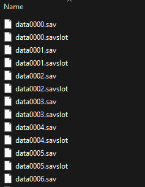
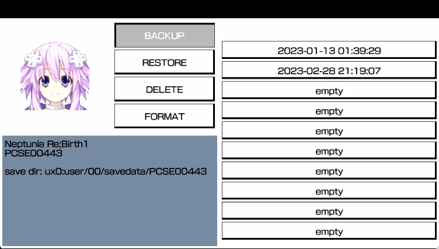
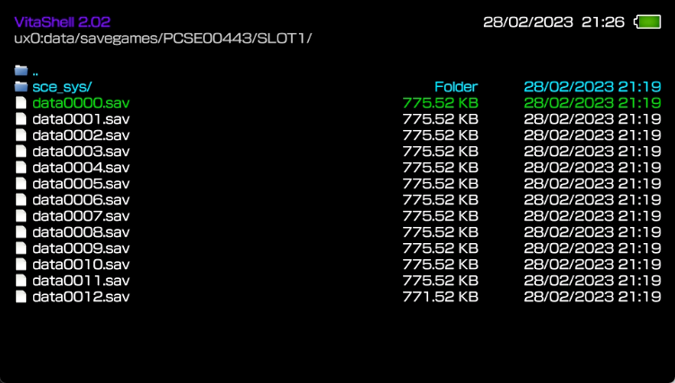
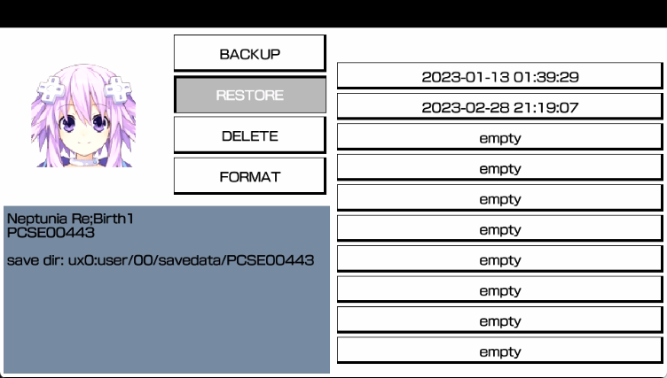

# Hyperdimension Neptunia Re;Birth 3

## DISCLAIMER
To do this actions you need a **jailbreaked** PS Vita and **game executable patch**. I **DO NOT** SUPPORT PIRACY OR ANYTHING. I USE ORIGINAL GAME VERSIONS FOR VITA AND STEAM.

**ALWAYS MAKE BACKUP OF SAVE FILES BEFORE DOING ANY ACTIONS.**

## Transfer from PC to Vita

### Open your saves directory on PC

Re;Birth 3 stores its saves at `C:\Program Files (x86)\Steam\userdata\YOUR_STEAM_ID\353270\remote` if you have installed Steam at standard path.

### Launch Re;Birth 3 on Vita, load existing save / start new game and save game at needed save slot.

For example, if we want to move first save slot, we need file `data0000.sav`. Second save slot is `data0001.sav`, third save slot is `data0002.sav` and so on.
You could also rename save files, it is not forbidden.

### Install (if not installed) and launch Save Manager, select Re;Birth 3 and backup game to any slot.

Use left stick or D-pad to navigate and touch screen to select the game.

### Copy and replace needed save files from PC to slot you have previously chosen.

Use VitaShell to transfer files from PC to Vita. Save Manager files are located at `ux0:data/savegames/GAME_ID/SLOTX` where `SLOTX` is your selected Save Manager slot and `GAME_ID` is your ID of installed game from specific region.
First slot is `SLOT0`, second is `SLOT1` and so on.
* `PCSE00661` - America
* `PCSG00486` - Japan
* `PCSB00751` - Europe

### Launch Save Manager again and restore from slot you have previously chosen.

### Launch the game and load needed save slot. Game should load transferred save. Re-save it from game UI to make save data look properly.

## Transfer from Vita to PC

### Open your saves directory on PC

Re;Birth 3 stores its saves at `C:\Program Files (x86)\Steam\userdata\YOUR_STEAM_ID\353270\remote` if you have installed Steam at standard path.

### Launch Re;Birth 3 on PC, load existing save / start new game and save game at needed save slot.

For example, if we want to move first save slot, we need file `data0000.sav`. Second save slot is `data0001.sav`, third save slot is `data0002.sav` and so on.
You could also rename save files, it is not forbidden.

### Install (if not installed) and launch Save Manager, select Re;Birth 3 and backup game to any slot.

Use left stick or D-pad to navigate and touch screen to select the game.

### Copy and replace needed save files from Vita to slot you have previously chosen.

Use VitaShell to transfer files from Vita to PC. Save Manager files are located at `ux0:data/savegames/GAME_ID/SLOTX` where `SLOTX` is your selected Save Manager slot and `GAME_ID` is your ID of installed game from specific region.
First slot is `SLOT0`, second is `SLOT1` and so on.
* `PCSE00661` - America
* `PCSG00486` - Japan
* `PCSB00751` - Europe

### [Download](https://crx.moe/nepsaves/NeptuniaReBirth3.exe) patched Re;Birth 3 game executable file and replace existing with it.

Use Steam's `Browse local files...` to open game directory.
This is required to bypass game save file validation check.
If you do not trust me, you can patch game yourself.
Use any hex editor (e.g. HxD) and replace offsets `309A3E` and `309BE1` with `00`.

### Launch the game and load needed save slot. Game should load transferred save. Re-save it from game UI to make save data look properly.

### (RECOMMENDED) Restore original game executable to avoid any unnecessary problems.

Use Steam's `Check files integrity...` to do it.

### If you have problems, try disabling Steam Cloud for a while.